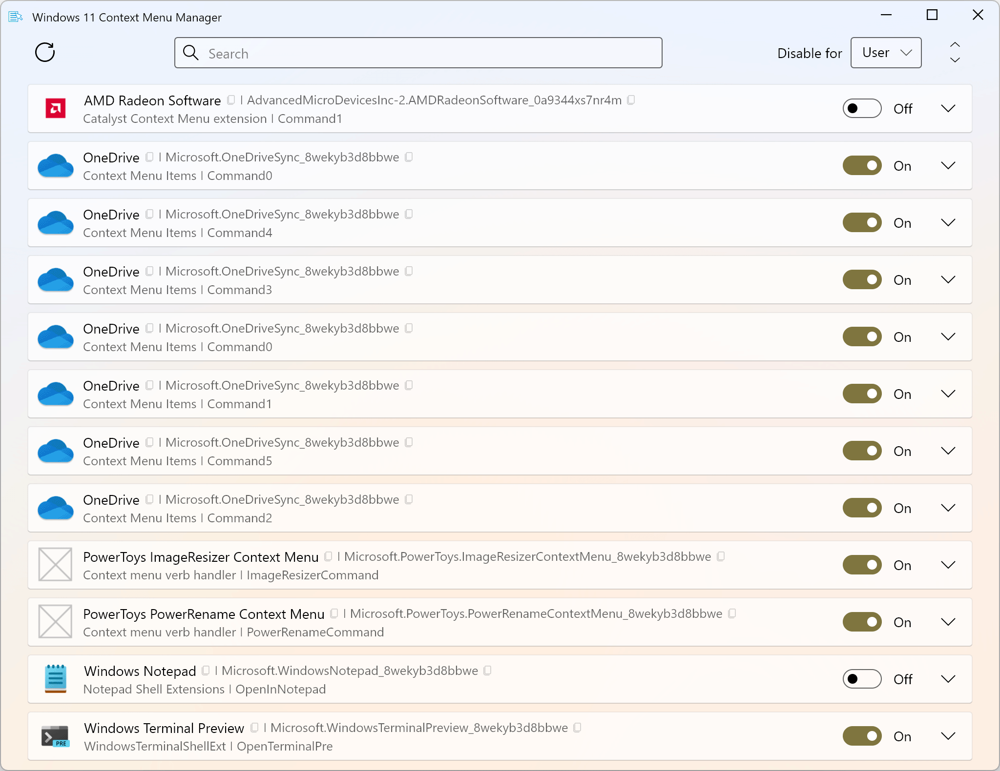
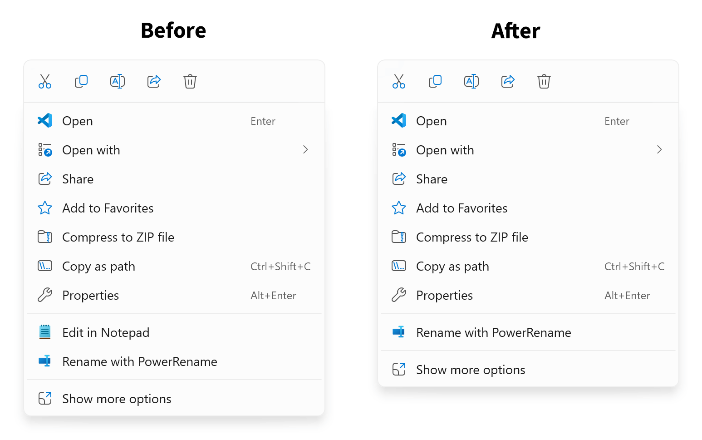

# Windows 11 Context Menu Manager

Windows 11 Context Menu Manager is a simple tool that allows you to disable unwanted entries in Windows 11 Explorer _new_ right-click context menu.

## Download

[Latest release](https://github.com/branhill/windows-11-context-menu-manager/releases/latest)

## Screenshots

## License

This project is licensed under the [MIT License](LICENSE)

Copyright (c) 2024 [Brandon Hill](https://branhill.com/)
